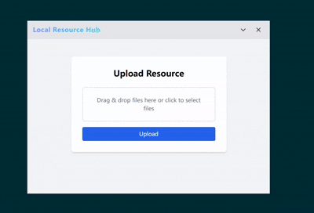

# LocalResourceHub

## Introduction

LocalResourceHub is a full-stack application designed for managing local resources. It provides a user-friendly interface and robust backend support, suitable for personal and small team resource management.

---

## Features
- Resource upload and management
- File categorization and search
- User authentication
- Responsive design, compatible with various devices

---

## Installation and Running

1. Clone this repository:
   ```bash
   git clone https://github.com/fromsko/LocalResourceHub.git
   ```
2. Start:
   ```bash
   cd LocalResourceHub
   wails dev
   ```

## Show



## License

This project is licensed under the [GPL-2.0](https://www.gnu.org/licenses/gpl-2.0.html) license.

---

For Chinese documentation, see [README.zh.md](README.zh.md).
